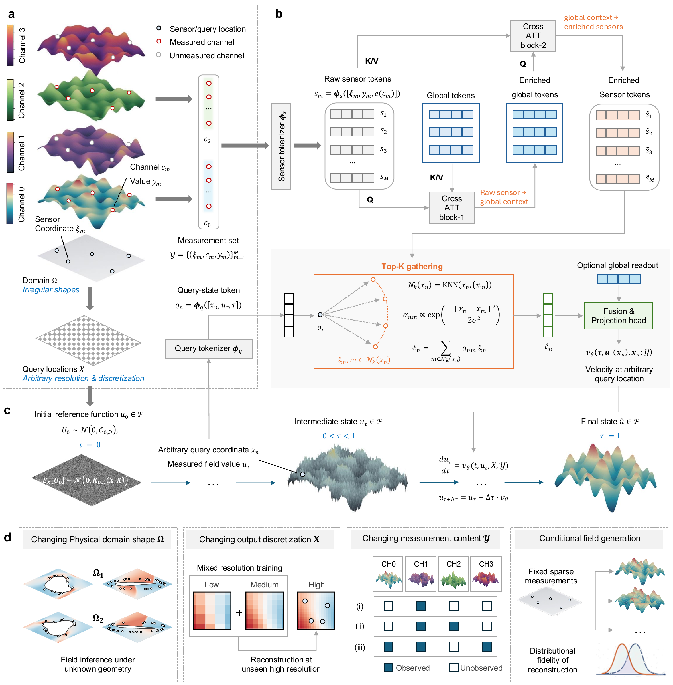
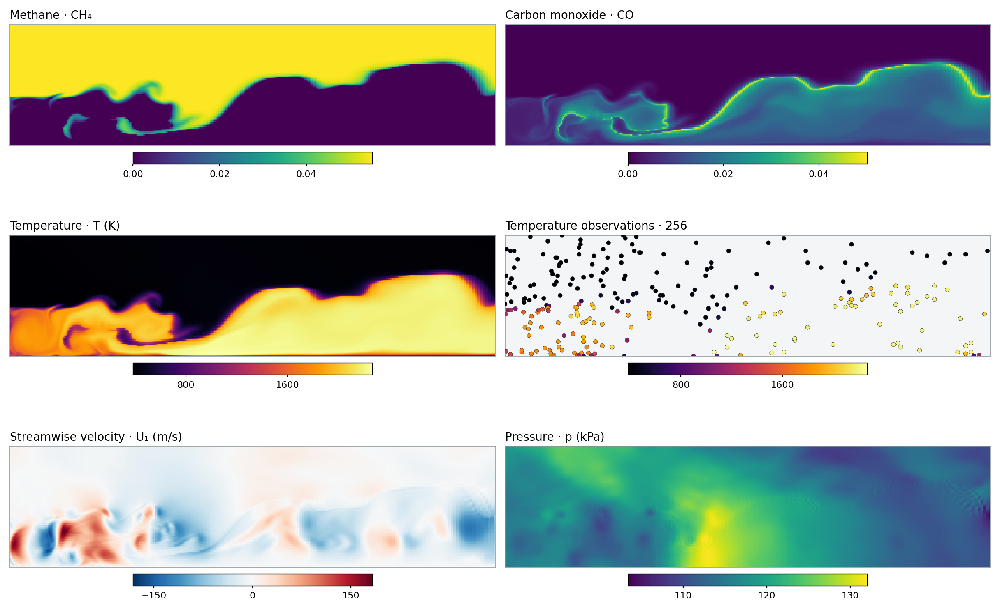
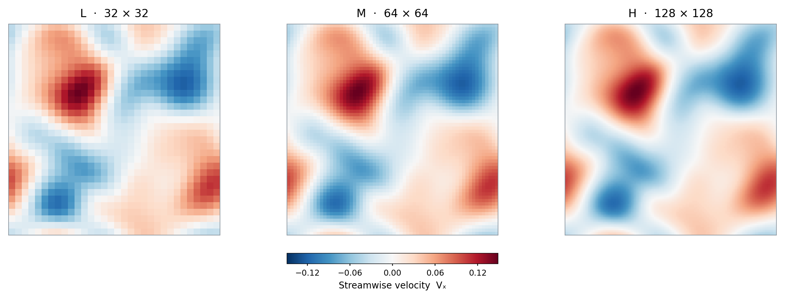
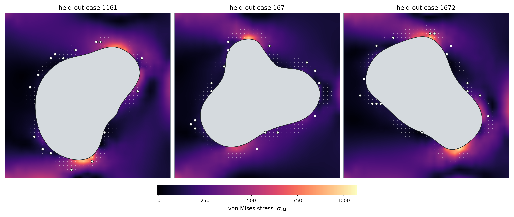
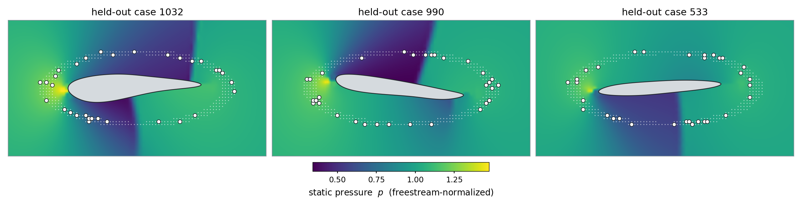

# DMF-Gen

**DMF-Gen** reconstructs a physical field from sparse measurements. Each measurement carries a coordinate, scalar value, and physical-channel label; the caller supplies separate coordinates where the complete field is needed. The model learns a rectified-flow velocity on normalized field values, conditioned by global latent attention and local RBF-weighted sensor evidence; evaluation and reconstruction convert outputs back to physical units.

**What you can run:** The repository provides the GL-RBF model family, data interfaces, and commands for training, evaluation, and reconstruction on turbulent combustion, mixed-resolution CFD, elasticity, and airfoil examples.

[](docs/_resources/Figure_ModelStructure.pdf)

**Measurements and queries.** On the left, each measured scalar carries its own coordinate and channel label, while separate query coordinates determine where the full field is reconstructed.

**Global and local conditioning.** The GL-RBF backbone turns measurements into sensor tokens, exchanges context with global latent tokens, and uses nearby RBF-weighted sensors to predict velocity at each query. The enhanced profile also includes a global query readout.

**Generation.** The middle row follows a Gaussian reference field as the learned velocity carries it toward a reconstruction.

**Tasks.** The bottom row illustrates changes in geometry, output resolution, observed channels, and conditional draws. The examples cover [mixed-resolution CFD](configs/mixed_hml.yaml), [five-field combustion](configs/combustion_cond_t.yaml), [elasticity](configs/elasticity_gl_rbf_enh.yaml), and [airfoil flow](configs/airfoil_gl_rbf_cq.yaml).

## Model and task map

| Profile | Model features | Example config |
| --- | --- | --- |
| `GL_rbf` | Global latent context and local RBF conditioning | [Base example](configs/gl_rbf_base.yaml) |
| `GL_rbf_ENH` | Fourier sensor features, repeated latent reads, and query latent readout | [Combustion](configs/combustion_cond_t.yaml), [mixed-resolution CFD](configs/mixed_hml.yaml), and [elasticity](configs/elasticity_gl_rbf_enh.yaml) |
| `GL_rbf_ENH_CQ` | Compact-query head used for the airfoil task | [Airfoil](configs/airfoil_gl_rbf_cq.yaml) and [optional profile](configs/gl_rbf_enh_cq.yaml) |

*Choose a profile through its YAML config; the model, observation pattern, training options, and evaluation options are kept together.*

## Install

**Requirements:** Python 3.10 or newer and PyTorch. Create an environment and install the package with:

```bash
python -m venv .venv
. .venv/bin/activate
python -m pip install --upgrade pip
python -m pip install -e .
```

**Optional acceleration:** PyKeOps can be installed for large point clouds (`pip install -e '.[keops]'`). Choose the neighbor backend in the YAML config and use an appropriate PyTorch build for your accelerator before starting a full training run.

## Data

**<ins>Before training:</ins>** See the [dataset guide](dataset/README.md) for dataset availability and placement. Put each task's data under `dataset/` in the documented layout. The loaders check field order and shape:

| Task | Fields | Native query points |
| --- | --- | --- |
| Combustion | `CH4, CO, T, U_1, p` | 40,300 |
| PDEBench CFD | processed `Vx` for paper examples | L 1,024; M 4,096; H 16,384 |
| Elasticity | von Mises stress and material mask | 1,681 |
| Airfoil | density, two velocity components, pressure, and fluid mask | 10,201 |

**Normalization statistics:** The example configs refer to optional precomputed files. If you have the data without matching statistics, set `data.stats_path` to `null` in your chosen config to compute statistics from the training split before use; this can take time on the full datasets. Evaluate a trained checkpoint with its original statistics.

*The figures below show raw held-out dataset states, not model reconstructions.*

### Five-field turbulent combustion

<a href="docs/figures/combustion_multifield.png"></a>

*Combustion example.* One held-out frame shows the five physical target fields. The colored dots show an illustrative set of 256 sparse temperature observations.

### Mixed-resolution CFD

<a href="docs/figures/cfd_resolution_hierarchy.png"></a>

*CFD example.* The same held-out state appears at 32 × 32, 64 × 64, and 128 × 128 points. The lower-resolution fields are spatial averages of the high-resolution field.

### Changing geometry

<a href="docs/figures/geometry_elasticity.png"></a>

*Elasticity example.* Three held-out unit cells share one 41 × 41 grid, but each void (grey) has its own shape. The model reconstructs the stress and the material mask from 16 stress sensors (white) drawn from the material next to the void (small dots).

<a href="docs/figures/geometry_airfoil.png"></a>

*Airfoil example.* Three held-out airfoils, cropped from one 101 × 101 grid. The model reconstructs density, velocity, pressure, and the fluid mask from 32 static-pressure sensors (white) drawn from one fixed ellipse (small dots); Mach number and drag are derived at evaluation.

**Example:** With the [elasticity data](dataset/README.md) in place, run one optimizer update and score two held-out cells:

```bash
dmf-train --config configs/elasticity_gl_rbf_enh.yaml --epochs 1 --batch-size 8 \
  --query-points 256 --max-steps 1 --validation-samples 2 --device cpu \
  --output-dir runs/elasticity_quickstart
dmf-evaluate --config configs/elasticity_gl_rbf_enh.yaml \
  --checkpoint runs/elasticity_quickstart/best.pt --max-samples 2 --device cpu \
  --output-dir runs/elasticity_quickstart/evaluation
```

Field errors use only points where the reference field exists, and the mask is scored as a thresholded shape. The per-case shape errors, stress concentration, Mach error, and drag go to `per_sample_task.csv`. The [airfoil profile](configs/airfoil_gl_rbf_cq.yaml) runs the same way, but its evaluation also needs `pip install -e '.[physics]'` for the drag metric.

## Quick start: train, evaluate, reconstruct

**Quick check:** After placing the combustion dataset, run one optimizer update on a small query subset to check the training, evaluation, and reconstruction commands:

```bash
# Train
dmf-train --config configs/gl_rbf_base.yaml --epochs 1 --batch-size 1 \
  --query-points 64 --max-steps 1 --validation-samples 1 \
  --device cpu --output-dir runs/quickstart

# Evaluate
dmf-evaluate --config configs/gl_rbf_base.yaml \
  --checkpoint runs/quickstart/best.pt --max-samples 1 --query-points 64 \
  --consistency none --device cpu --output-dir runs/quickstart/evaluation

# Reconstruct
dmf-reconstruct --config configs/gl_rbf_base.yaml \
  --checkpoint runs/quickstart/best.pt --sample-index 0 --query-points 64 \
  --consistency none --device cpu --output runs/quickstart/reconstruction.npz

# Optional diagnostic plot
python -m pip install -e '.[plot]'
dmf-plot runs/quickstart/reconstruction.npz --output runs/quickstart/reconstruction.png
```

**Query subset note:** `--consistency none` is used here because the sampled query points may not contain the observed points. Full-grid evaluation can use the consistency setting in the selected config.

**Larger experiments:** [Cond-T combustion](configs/combustion_cond_t.yaml), [Cond-T/U1 combustion](configs/combustion_cond_tu1.yaml), [Cond-CO/T/U1/p combustion](configs/combustion_cond_cotu1p.yaml), and [mixed-resolution CFD](configs/mixed_hml.yaml) provide ready-to-edit task configs.

For example, train the Cond-T task with `dmf-train --config configs/combustion_cond_t.yaml --device cuda:0 --output-dir runs/combustion_cond_t`; adjust the YAML training settings to fit your hardware and experiment.

## Outputs and interpretation

**Training** writes a resolved config, metrics, a run log, and checkpoints under the chosen `runs/` folder. Set `training.plot_every_epochs` to a positive integer to save `loss_history.csv` and `loss_history.png`, or set `evaluation.every_epochs` to run periodic physical-field evaluation.

**Evaluation** writes per-sample and per-field physical relative-L2 results. Set `evaluation.plot_samples: 1` to also save one full-field truth/reconstruction/absolute-error PNG per channel for the first deterministic held-out sample. Scheduled evaluations place these panels beside `summary.json` in `evaluation/epoch_XXXX/`; the summary records the sample ID and filenames. Plotting requires the optional `plot` dependencies (`pip install -e '.[plot]'`). **Reconstruction** writes coordinates, observations, targets, and sampled predictions to an NPZ file that `dmf-plot` can visualize.
